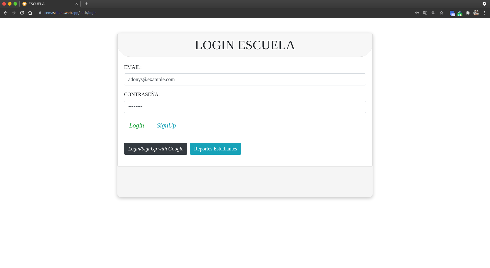
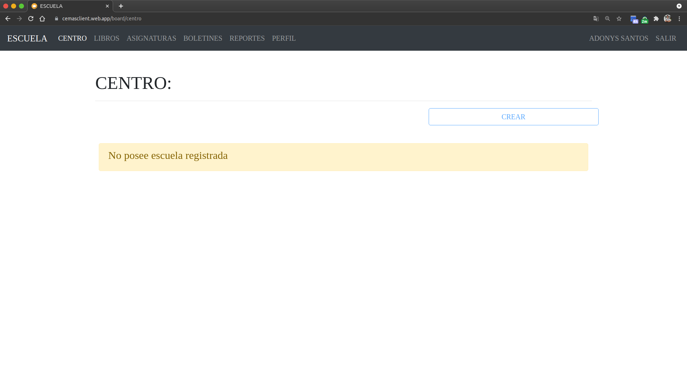

# Iniciar sesión

Si anteriormente has creado una cuenta en el sitio, puedes iniciar sesión con tu dirección de correo electrónico y contraseña.

## 1. Escribe el correo electrónico y la contraseña con la que te registraste y luego presiona el boton verde que dice "Login" o "Iniciar sesión".

## 2. Listo! Ya iniciaste sesión.

[Volver al inicio](../ 'Volver al inicio')
