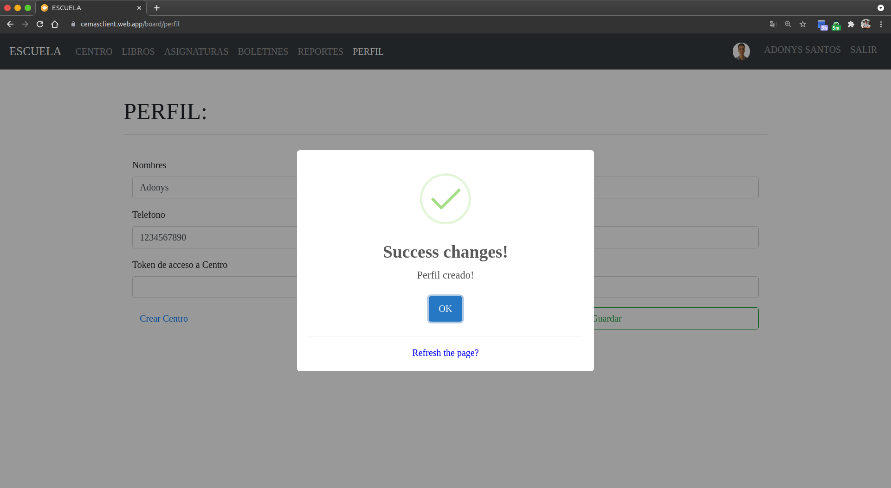

# Configurando el perfil

## 1. Ve a la sección de "perfil" en la barra de navegación.

## 2. Completa el formulario con tus datos y guarda los cambios.

**Nota:** el `token` es una clave que la genera el **coordinador** del centro y sirve para que los **profesores** puedan unirse a la escuela. - [_Click aquí para aprender a crear una escuela y obtener un token._](../coordinator/create-school.html)

## 3. ¡Listo! Tu perfil está configurado.

**Nota:** esta informacion es almacenada de forma segura en nuestra base de datos.

[Volver al inicio](../ 'Volver al inicio')
