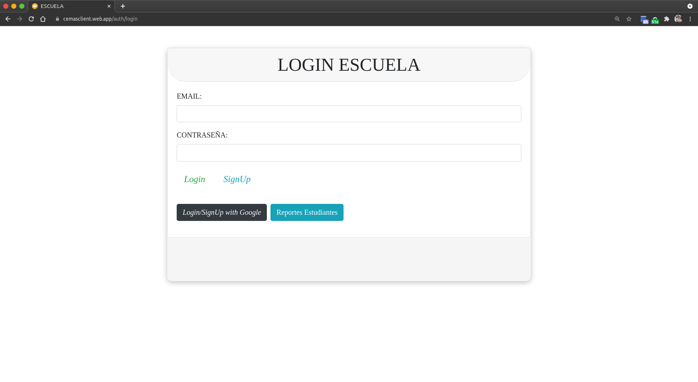
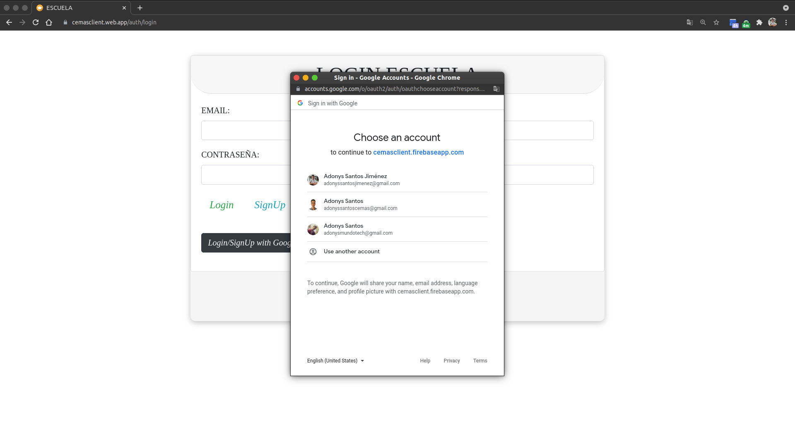

# Iniciar sesion con Google

Para evitar el proceso de registro e inicio de sesión, puedes iniciar sesion con Google.

## 1. Da clic en el boton de color negro que dice "Login/SignUp with Google" o "Inicia con Google".

## 2. Selecciona la cuenta con la que quieres Iniciar Sesion

## 3. Listo! Ya estas logeado con Google.

[Volver al inicio](../ 'Volver al inicio')
