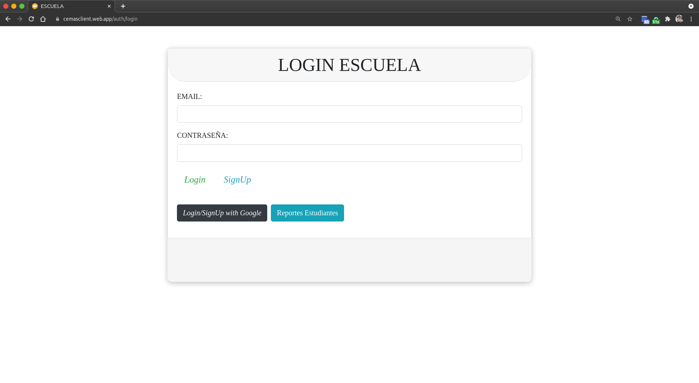
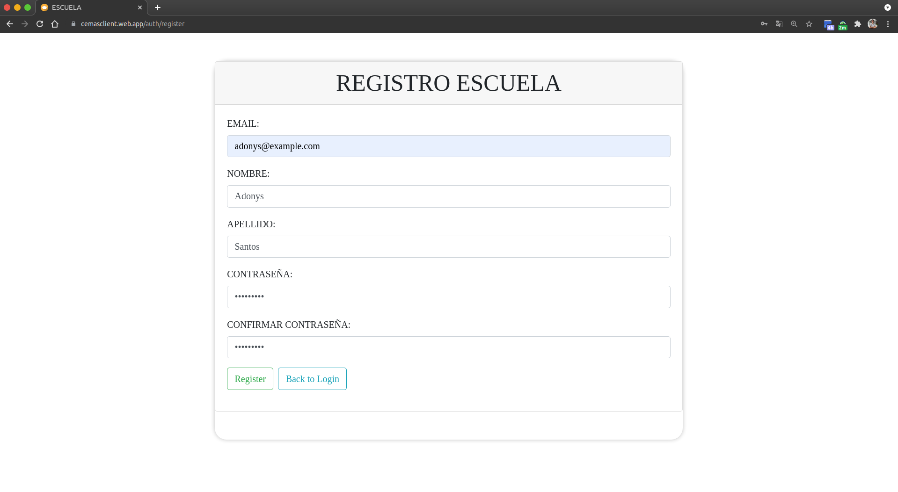
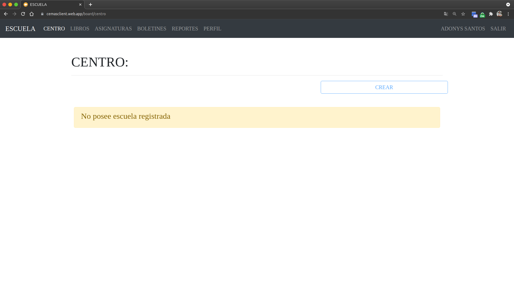

# Crear cuenta o registrarse

Cuando entras a la aplicación por primera vez, debes crear una cuenta o registrarte.

## 1. Ve al boton "SignUp" o "Registrarse"

## 2. Completa los campos

## 3. Listo! Ya estas registrado!

[Volver al inicio](../ 'Volver al inicio')
