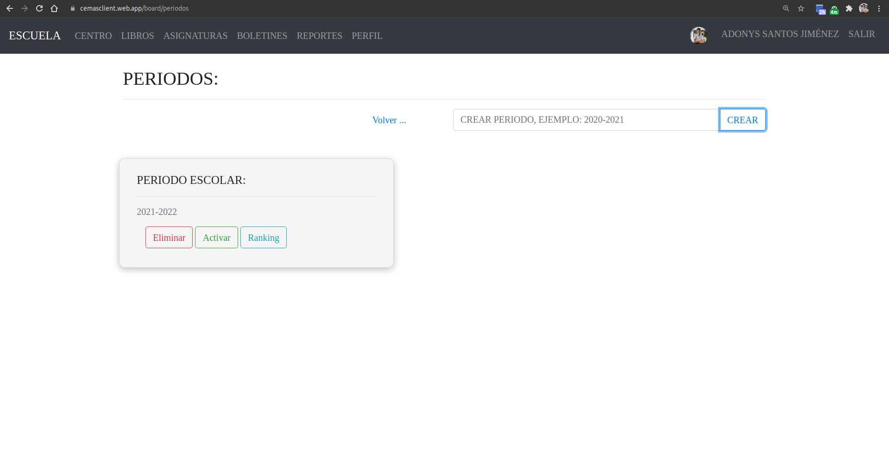

# Crear un nuevo periodo

## 1. Dale click al botón verde en la parte inferior que dice "Periodos".

## 2. Coloca el nombre del periodo que quieres crear.

## 3. Dale click al botón azul que dice "Crear".

## 4. Si todo salió bien, aparecerá un mensaje de éxito. Presiona el botón azul que dice "Ok".

## 5. Dale click al botón verde que dice "Activar" en el periodo que acabas de crear.

_Si un periodo esta desactivado los maestros no podran hacer cambios en dicho periodo_

_Puedes crear todos los periodos que necesites, aunque es recomendable que solo tengas 1 activado._

**Sugerencias:**

- [Activar/desactivar periodos escolares.](./toggle-period.html)
- [Activar/desactivar profesores.](./toggle-teachers.html)

[Volver al inicio](../ 'Volver al inicio')
