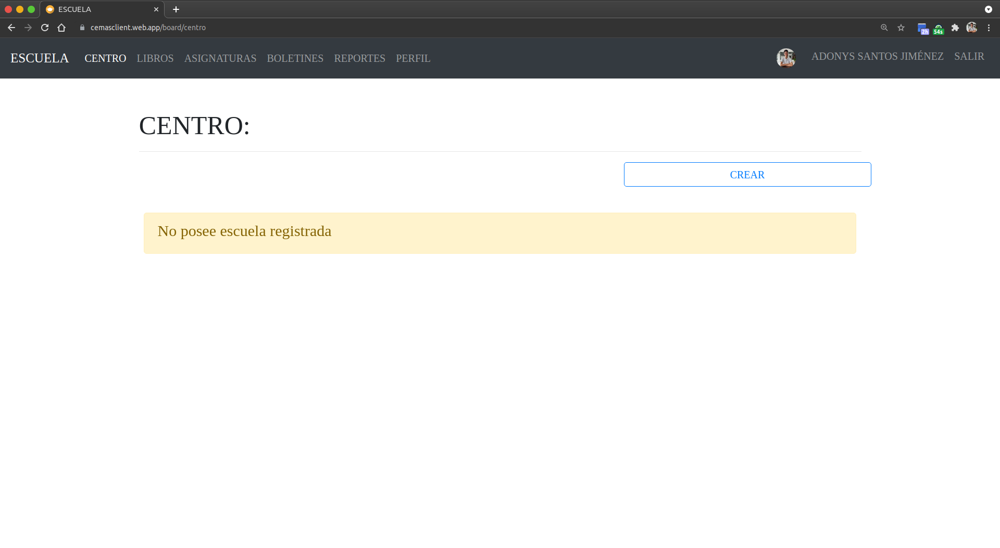
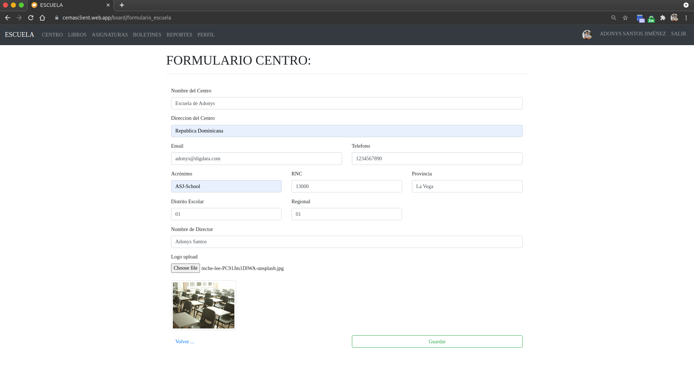
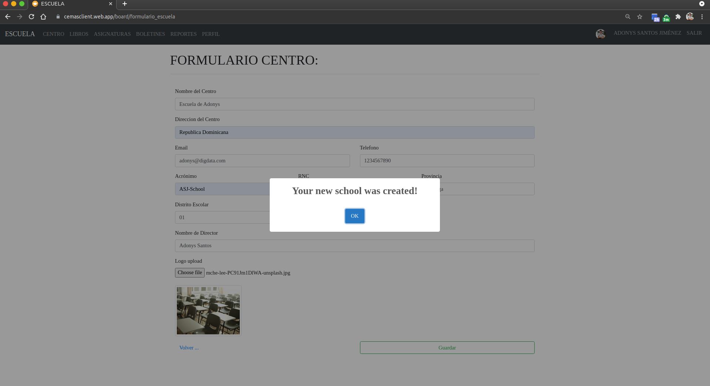

# Crear una nueva escuela

## 1. Ve a la sección de **Centro** en el menú de navegación.

## 2. Dale click en el boton azul que dice "Crear" en la parte superior derecha y completa los datos.

_Si no te lleva a esto formulario es porque aun no has [configurado tu perfil](../auth/settings.html)._

## 3. Dale click en el boton verde que dice "Guardar" en la parte inferior derecha.

## 4. Listo! Si vuelves a la sección de **Centro**, aparecera la informacion de la escuela.

_El **Acceso** es un código que se le debe pasar a los maestros para que se registren en la escuela_

**Sugerencias**:

- [Crear periodo escolar para la escuela.](./create-period.html)
- [Activar/desactivar periodos escolares.](./toggle-period.html)
- [Activar/desactivar profesores.](./toggle-teachers.html)

[Volver al inicio](../ 'Volver al inicio')
