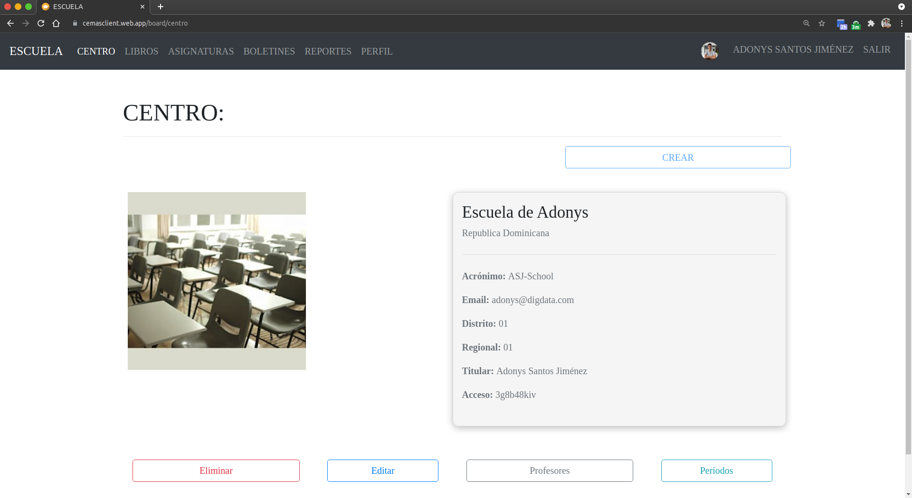
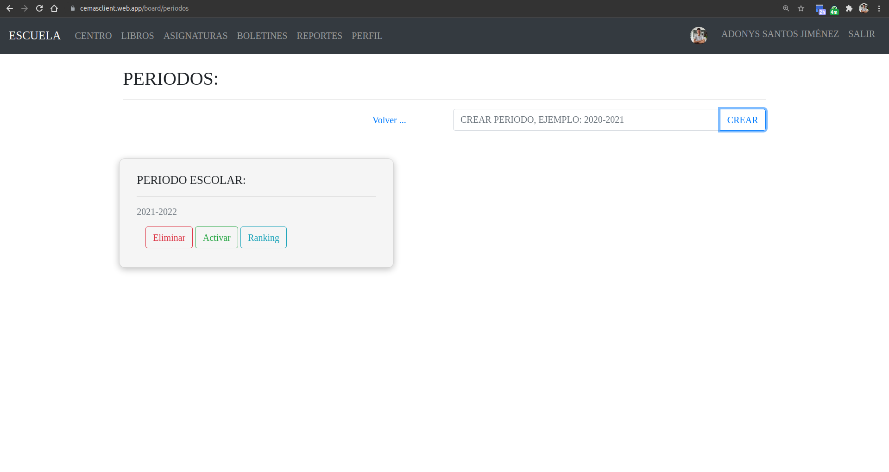

# Activar/desactivar periodo

Cuando finaliza un periodo, el coordinador puede desactivarlo.

Al desactivar el periodo, los maestros no podran hacer cambios en las calificaciones de los alumnos de dicho periodo.

## 1. Dale click al botón verde en la parte inferior que dice "Periodos".

## 2. Dale click en el botón "Activar/desactivar" según el caso.

**Sugerencias:**

- [Activar/desactivar profesores.](./toggle-teachers.html)

[Volver al inicio](../ 'Volver al inicio')
