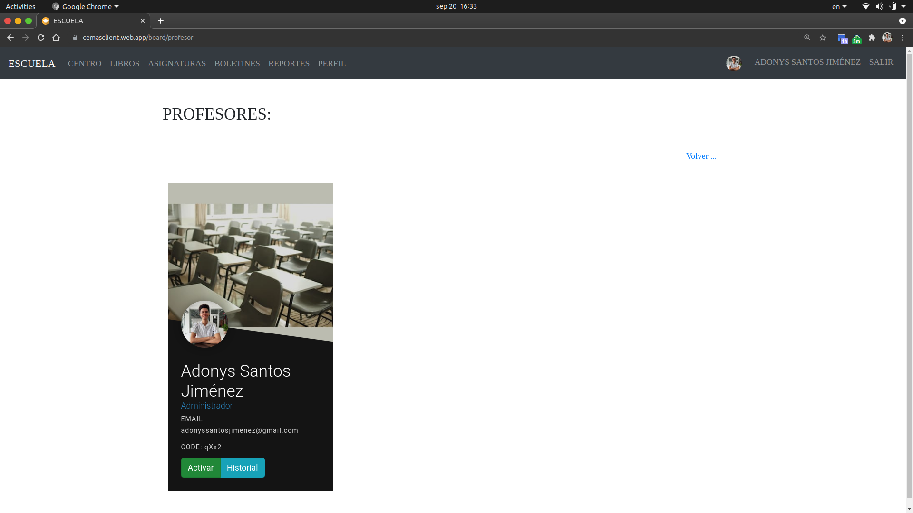

# Activar/desactivar profesores

Cuando un maestro se registra necesita que el coordinador lo active para que pueda utilizar la plataforma.

## 1. Dale click al botón verde en la parte inferior que dice "Profesores".

## 2. Tendras una lista con todos los profesores que se registraron en la escuela. Presiona en el botón verde o amarillo que dice "Activar/desactivar".

**Sugerencias:**

- [Unirse a una escuela como profesor.](../teacher/join-school.html)
- [Activar/desactivar periodos escolares.](./toggle-period.html)

[Volver al inicio](../ 'Volver al inicio')
